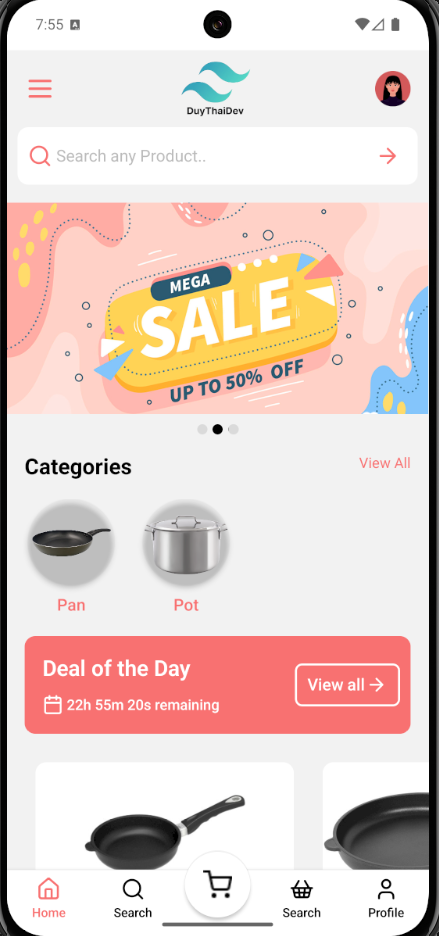
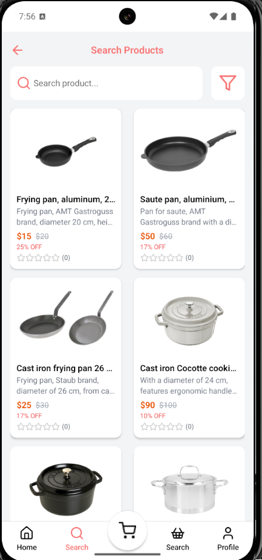

<div align="center">


  <h3 align="center">E-Commerce Kitchen Utensils React Native App</h3>

   <div align="center">
     Welcome to the E-Commerce Kitchen Utensils React Native App! This app is designed to offer a comprehensive E-Commerce solution with a focus on responsiveness and smooth animations.
    </div>
    
  <div>
      
    
  </div>

<br />
    <a href="https://github.com/duythaidev/kitchen-utensils" target="_blank">
           
           
    </a>
  <br />
</div>

## 🚀 Getting Started with Expo

This project is built with **Expo**. Follow the steps below to set up the environment and run the app.

### ✅ Prerequisites

Make sure you have the following installed:

* [Node.js](https://nodejs.org/)
* [Expo CLI](https://docs.expo.dev/get-started/installation/)
* [Android Studio](https://developer.android.com/studio) (with an emulator configured)

### 📦 Install Dependencies

```bash
npm install
```

### ▶️ Start the Development Server

```bash
expo start
```

This will open the Expo Dev Tools in your browser.

### 📱 Run on Android Emulator

1. Open **Android Studio**
2. Launch an Android **emulator** from Device Manager
3. In the **Expo Dev Tools** (browser), click **"Run on Android device/emulator"**